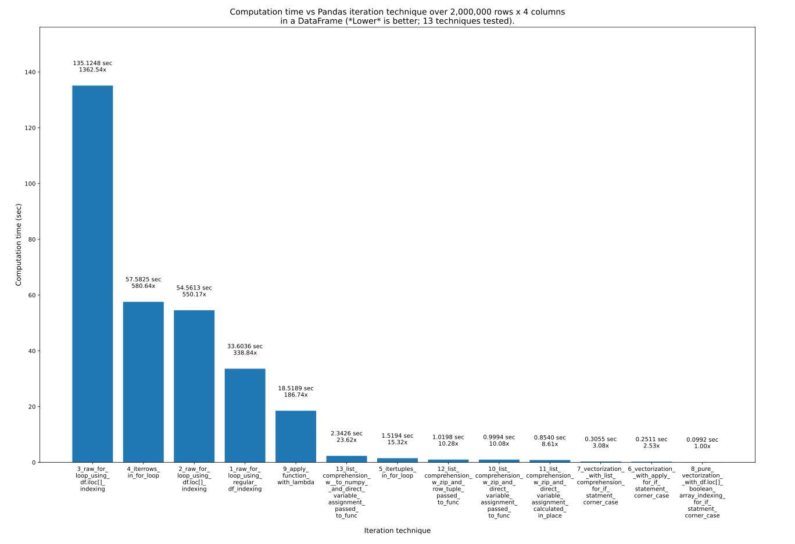

This file is part of eRCaGuy_hello_world: https://github.com/ElectricRCAircraftGuy/eRCaGuy_hello_world


# Table of Contents
<details>
<summary><b>(click to expand)</b></summary>
<!-- MarkdownTOC autolink="true" autoanchor="true" style="ordered" -->

1. [What is Pandas?](#what-is-pandas)
1. [Learning resources](#learning-resources)
1. [Pandas `DataFrame`s, "gotchas", & misc. notes](#pandas-dataframes-gotchas--misc-notes)
    1. [Summary of my 4 or 5 main Python Pandas problems from Sept.-Oct. 2023](#summary-of-my-4-or-5-main-python-pandas-problems-from-sept-oct-2023)
    1. [Misc. notes](#misc-notes)
    1. [_Special keywords or values_ that Pandas will recognize and treat special when parsing a CSV file](#special-keywords-or-values-that-pandas-will-recognize-and-treat-special-when-parsing-a-csv-file)
    1. [You can*not* detect `NaN` values with `==` or `!=`! `np.nan == np.nan` is `False`!](#you-cannot-detect-nan-values-with--or--npnan--npnan-is-false)
    1. [Full list of `NaN` values in Pandas:](#full-list-of-nan-values-in-pandas)
    1. [When merging two or more `DataFrame`s, call `reset_index()` on each one first!](#when-merging-two-or-more-dataframes-call-reset_index-on-each-one-first)

<!-- /MarkdownTOC -->
</details>


<a id="what-is-pandas"></a>
# What is Pandas?

Me: 
> What is Pandas?

GitHub Copilot:
> **Pandas** is a popular open-source Python library for data manipulation and analysis. It provides data structures for efficiently storing and manipulating large datasets, as well as tools for data cleaning, merging, reshaping, and visualization.
> 
> The two primary data structures in Pandas are the `Series` and `DataFrame` objects. A `Series` is a one-dimensional array-like object that can hold any data type, while a `DataFrame` is a two-dimensional table-like object that can hold multiple `Series` objects. Pandas also provides many functions for working with these data structures, including functions for filtering, grouping, and aggregating data.
> 
> Pandas is widely used in data science, finance, and other fields where large datasets need to be analyzed and manipulated. It is often used in conjunction with other Python libraries such as **NumPy**, **Matplotlib**, and **Scikit-learn** to create powerful data analysis and visualization tools.

From Wikipedia: https://en.wikipedia.org/wiki/Pandas_(software):

>  The name is derived from the term "panel data", an econometrics term for data sets that include observations over multiple time periods for the same individuals.


<a id="learning-resources"></a>
# Learning resources

_Rough list order: most useful first:_

1. Talk to GitHub Copilot, Bing AI, and ChatGPT for help to use it.
1. Official Pandas User Guide: 10 minutes to pandas: https://pandas.pydata.org/pandas-docs/stable/user_guide/10min.html
1. https://github.com/Coldsp33d/stackoverflow-pandas-canonicals - a collection of resources by this avid Pandas user and high-reputation Stack Overflow user, [@cs95](https://stackoverflow.com/users/4909087/cs95).
    1. [How to iterate over rows in a DataFrame in Pandas? Answer: DON'T\*!](https://stackoverflow.com/a/55557758/4561887)
    1. [NEVER grow a DataFrame row-wise!](https://stackoverflow.com/a/56746204/4561887)
    1. [What is "vectorization"?](https://stackoverflow.com/q/1422149/4561887)
1. Official Pandas reference documentation: https://pandas.pydata.org/docs/reference/frame.html
1. https://docs.python.org/3/tutorial/datastructures.html#list-comprehensions


<a id="pandas-dataframes-gotchas--misc-notes"></a>
# Pandas `DataFrame`s, "gotchas", & misc. notes

This is too big of a topic to cover here, so let me just put down a few reminders and notes to myself regarding some "gotchas" and things.


<a id="summary-of-my-4-or-5-main-python-pandas-problems-from-sept-oct-2023"></a>
## Summary of my 4 or 5 main Python Pandas problems from Sept.-Oct. 2023

1. `None`, `nan`, no chars after a comma, etc, are interpreted as NaNs when reading a CSV file with `np.read_csv()`
2. When importing a pandas-generated CSV file into LibreOffice Calc (or MS Excel), don't choose to "merge delimiters" or else it drops NaNs and misaligns columns since a bunch of commas in a row in a CSV file actually represents as a bunch of NaNs! (one after each comma). Therefore, when you "merge delimiters" you just removed all of those sequential NaNs in that row!
3. Use `.copy()` to create deep copies of a Pandas data series or DataFrame, or Python list or dict, or other mutable object, when necessary. Since DataFrames are _mutable_ objects, if you try to just use the equals sign (`=`) to copy it will cause side effects where multiple variable labels are editing the same underlying data, so changing one variable changes the data in the other variable.
4. `np.nan == np.nan` is `False`. Use `.dropna()` instead of Boolean indexing to drop NaNs.
5. You must reset indices before merging DataFrames or else you'll have a ton of dropped data and NaNs in your destination dataframe since they are copied absolute index to absolute index, rather than by relative sequence. See my "Full DataFrame merging demo" below.

Also:
1. *Not* iterating over DataFrames is best: [How to iterate over rows in a DataFrame in Pandas](https://stackoverflow.com/a/55557758/4561887)
    
    I'll add my own answer to the question above soon.

    See my work here: [pandas_dataframe_iteration_vs_vectorization_vs_list_comprehension_speed_tests.py](pandas_dataframe_iteration_vs_vectorization_vs_list_comprehension_speed_tests.py)_
    
    <a href="pandas_dataframe_iteration_vs_vectorization_vs_list_comprehension_speed_tests.svg">
        <p align="left" width="100%">
             
        </p>
    </a>


<a id="misc-notes"></a>
## Misc. notes

The [haversine formula](https://en.wikipedia.org/wiki/Haversine_formula) can be used to get curved arc distance between two longitude/latitude points.


<a id="special-keywords-or-values-that-pandas-will-recognize-and-treat-special-when-parsing-a-csv-file"></a>
## _Special keywords or values_ that Pandas will recognize and treat special when parsing a CSV file

When calling `pd.read_csv()`, the parser will interpret your CSV file based on heuristics. Ex: `1.0` is a float, `1` is an int, `True` is a boolean, `NaN`, or `None` are `np.nan` NaN values, multiple commas in a row with nothing between them (or perhaps only whitespace), are also NaNs, `Noon` or any other non-keyword strings are just strings, etc. Here is what GitHub Copilot told me: 

**Me**: Give me a list of special keywords or values that Pandas will recognize and treat special in a CSV file.

**GitHub Copilot:**

> Pandas recognizes the following special keywords or values in a CSV file:
> 
> - `NaN`: This is a special value that represents a missing or undefined value. Pandas will interpret any cell in a CSV file that contains the string "NaN" as a missing or NaN value.
> - `None`: This is another special value that represents a missing or undefined value. Pandas will interpret any cell in a CSV file that is empty or contains the string "None" as a missing or NaN value.
> - `Inf` and `-Inf`: These are special values that represent positive and negative infinity, respectively. Pandas will interpret any cell in a CSV file that contains the string "Inf" or "-Inf" as the corresponding infinity value.
> - `True` and `False`: These are special values that represent boolean values. Pandas will interpret any cell in a CSV file that contains the string "True" or "False" as the corresponding boolean value.
> - Dates and times: Pandas can recognize and parse a variety of date and time formats in a CSV file, including ISO 8601 format, Excel serial date format, and many others. Pandas will automatically convert these values to the appropriate datetime data type.
> 
> Note that Pandas can also recognize and parse other special values and formats in a CSV file, depending on the data type of the column and the parsing options specified. However, the above list includes some of the most common special values and formats that Pandas users may encounter in a CSV file.

ElectricRCAircraftGuy: Give me some online links to the documentation that lists these special keywords or values.

GitHub Copilot: 

> Sure, here are some links to the Pandas documentation that describe the special keywords or values recognized by Pandas in a CSV file:
> 
> - `NaN`: https://pandas.pydata.org/pandas-docs/stable/user_guide/missing_data.html#missing-data [GS: see below for a "Full list of `NaN` values in Pandas"]
> - `None`: https://pandas.pydata.org/pandas-docs/stable/user_guide/missing_data.html#missing-data
> - `Inf` and `-Inf`: https://pandas.pydata.org/pandas-docs/stable/user_guide/io.html#na-values
> - `True` and `False`: https://pandas.pydata.org/pandas-docs/stable/user_guide/io.html#na-values
> - Dates and times: https://pandas.pydata.org/pandas-docs/stable/user_guide/io.html#datetime-handling


<a id="you-cannot-detect-nan-values-with--or--npnan--npnan-is-false"></a>
## You can*not* detect `NaN` values with `==` or `!=`! `np.nan == np.nan` is `False`!

I also learned here (https://pandas.pydata.org/pandas-docs/stable/user_guide/missing_data.html#missing-data) to watch out for this gotcha!: 

You can*not* detect `NaN` values with `==` or `!=`! You must use `pd.isna()` or `pd.notna()` instead!

> **Warning**
> 
> One has to be mindful that in Python (and NumPy), the `nan`'s don’t compare equal, but `None`'s do. Note that pandas/NumPy uses the fact that `np.nan != np.nan`, and treats `None` like `np.nan`.
> 
> ```py
> None == None  # noqa: E711
> Out[11]: True
> 
> np.nan == np.nan
> Out[12]: False
> ```
> 
> So as compared to above, a scalar equality comparison versus a `None`/`np.nan` doesn’t provide useful information.

In other words, again, you can*not* use `== np.nan` or `!= np.nan` to detect `NaN` values! You must use `pd.isna()` or `pd.notna()` instead!

Ex:
```py
import pandas as pd

# Example DataFrame with NaN values
df = pd.DataFrame({'col1': [1, 2, None, 4], 'col2': ['a', 'b', 'c', None]})

# Use pd.isna() to detect NaN values (None being one of those)
nan_mask = pd.isna(df)

# Print the mask
print(nan_mask)
```

Output:
```
    col1   col2
0  False  False
1  False  False
2   True  False
3  False   True
```


<a id="full-list-of-nan-values-in-pandas"></a>
## Full list of `NaN` values in Pandas:

And this source tells me the full list of strings in a CSV file that will be interpreted as `NaN` values: https://pandas.pydata.org/pandas-docs/stable/user_guide/io.html#na-values :

> The default `NaN` recognized values are `['-1.#IND', '1.#QNAN', '1.#IND', '-1.#QNAN', '#N/A N/A', '#N/A', 'N/A', 'n/a', 'NA', '<NA>', '#NA', 'NULL', 'null', 'NaN', '-NaN', 'nan', '-nan', 'None', '']`.

Full list of `NaN` values in Pandas:

- `NaN` (`pd.nan`) values are recognized by default in Pandas from the following strings when reading a CSV file: 
    - `'-1.#IND'`
    - `'1.#QNAN'`
    - `'1.#IND'`
    - `'-1.#QNAN'`
    - `'#N/A N/A'`
    - `'#N/A'`
    - `'N/A'`
    - `'n/a'`
    - `'NA'`
    - `'<NA>'`
    - `'#NA'`
    - `'NULL'`
    - `'null'`
    - `'NaN'`
    - `'-NaN'`
    - `'nan'`
    - `'-nan'`
    - `'None'`
    - `''` - empty string, ex: signified by two commas in a row with nothing between them (`,,`), or a comma at the beginning of a line with nothing in front of it (`,`), or perhaps only whitespace in front of a comma [I have not tested the whitespace one, but I know the comma thing to be true]


<a id="when-merging-two-or-more-dataframes-call-reset_index-on-each-one-first"></a>
## When merging two or more `DataFrame`s, call `reset_index()` on each one first!

WARNING!: if you merge two dataframes with the same length but different indices, they will merge by index, not by placement in the length (internal list) of the dataframe, and you'll end up with a bunch of dropped data and unexpected `NaN`s! 

Ex: imagine you have `df1` and `df2`. Both are length `10`, but `df1` had previously dropped every other row when it was length `20`, so its indices count _by twos_ from `0` to `18`, whereas `df2` was just created and has a fresh index from `0` to `9`, counting by ones. Again, both are length `10`. If you merge them by doing `df1['A_new'] = df2['A']`, you'll get all `NaN`s in `df1` after index `8`, which is only **halfway to the end** of `df1`, since `df1`'s index counts by twos! The data for all index numbers in `df2` which don't match existing index numbers in `df1` (ie: all odd indices in `df2` in this case) will be _thrown away_, which means you're accidentally throwing away every other value from `df2`, when you intended to put *all* values from `df2['A']` into `df1`! And again, all indices after index `8` in `df1['A_new']` will be `NaN` since there are no indices after that point in `df2['A']` to copy from `df1['A']` into `df2['A_new']`! _Copies between data Series or DataFrames are **by absolute index** with a 1-to-1 match of index to index, not by relative location in the list._

So, the solution is to **reset the indices of both dataframes before merging them,** like this:

```py
# Modify the index in-place, rather than creating a new dataframe, and drop (do NOT keep) 
# the old index as a new column inside the dataframe.
df1.reset_index(drop=True, inplace=True)
df2.reset_index(drop=True, inplace=True)

# Now that they are both of length 50 and have the same indices 0 to 49, merge them.
# - In this case, simply copy the column 'A' from df1 into df2.
df1['A_new'] = df2['A']
```

**Full DataFrame merging demo:**

```py
import pandas as pd

df1 = pd.DataFrame({'A': range(20)})
df2 = pd.DataFrame({'A': range(10)})

print(f"df1 original:\n{df1}\n")
print(f"df2 original:\n{df2}\n")

# Now drop all even rows from df1, so it is length 10, and has indices 
# 0, 2, 4, 6, 8, 10, 12, 14, 16, 18
# - for `::2`, see: https://docs.python.org/3/library/stdtypes.html#sequence-types-list-tuple-range
#   `s[i:j:k]` means "slice of s from i to j with step k"
df1 = df1.iloc[::2, :]
# OR use boolean indexing to accomplish the same thing
# mask = df1.index % 2 == 0
# df1 = df1[mask]
print(f"df1 after removing odd indices from df1:\n{df1}\n")

# Now merge df2 into df1
# - This will merge by index, not by placement in the length (internal list) of the dataframe.
df1['A_new'] = df2['A']
print(f"df1 after adding column `A_new` (notice all of the NaNs, and the dropped "
      f"odd values!):\n{df1}\n")

# Now fix the problem by resetting the index of df1 first. To be safe, it's not a bad idea to 
# reset *both* indices first, even though technically df2's index is already fine here.
df1.reset_index(drop=True, inplace=True)
df2.reset_index(drop=True, inplace=True)

print(f"df1 after calling `.reset_index()` (the index now counts by 1s 0 to 9 "
      f"instead of by 2s 0 to 18):\n{df1}\n")
print(f"df2 after calling `.reset_index()` (no change):\n{df2}\n")
print("Notice that the indices of df1 and df2 now exactly match!")

df1['A_new2'] = df2['A']

print(f"df1 after adding column `A_new2` to `df1` (no lost data!--all of\n"
      f"df2['A'] made it into df1['A_new2'] this time withOUT dropping values\n"
      f"and inserting NaNs instead!):\n{df1}\n")
print(f"df2 after adding column `A_new2` to `df1` (no change):\n{df2}\n")
```

Output:
```
df1 original:
     A
0    0
1    1
2    2
3    3
4    4
5    5
6    6
7    7
8    8
9    9
10  10
11  11
12  12
13  13
14  14
15  15
16  16
17  17
18  18
19  19

df2 original:
   A
0  0
1  1
2  2
3  3
4  4
5  5
6  6
7  7
8  8
9  9

df1 after removing odd indices from df1:
     A
0    0
2    2
4    4
6    6
8    8
10  10
12  12
14  14
16  16
18  18

df1 after adding column `A_new` (notice all of the NaNs, and the dropped odd values!):
     A  A_new
0    0    0.0
2    2    2.0
4    4    4.0
6    6    6.0
8    8    8.0
10  10    NaN
12  12    NaN
14  14    NaN
16  16    NaN
18  18    NaN

df1 after calling `.reset_index()` (the index now counts by 1s 0 to 9 instead of by 2s 0 to 18):
    A  A_new
0   0    0.0
1   2    2.0
2   4    4.0
3   6    6.0
4   8    8.0
5  10    NaN
6  12    NaN
7  14    NaN
8  16    NaN
9  18    NaN

df2 after calling `.reset_index()` (no change):
   A
0  0
1  1
2  2
3  3
4  4
5  5
6  6
7  7
8  8
9  9

Notice that the indices of df1 and df2 now exactly match!

df1 after adding column `A_new2` to `df1` (no lost data!--all of
df2['A'] made it into df1['A_new2'] this time withOUT dropping values
and inserting NaNs instead!):
    A  A_new  A_new2
0   0    0.0       0
1   2    2.0       1
2   4    4.0       2
3   6    6.0       3
4   8    8.0       4
5  10    NaN       5
6  12    NaN       6
7  14    NaN       7
8  16    NaN       8
9  18    NaN       9

df2 after adding column `A_new2` to `df1` (no change):
   A
0  0
1  1
2  2
3  3
4  4
5  5
6  6
7  7
8  8
9  9
```
